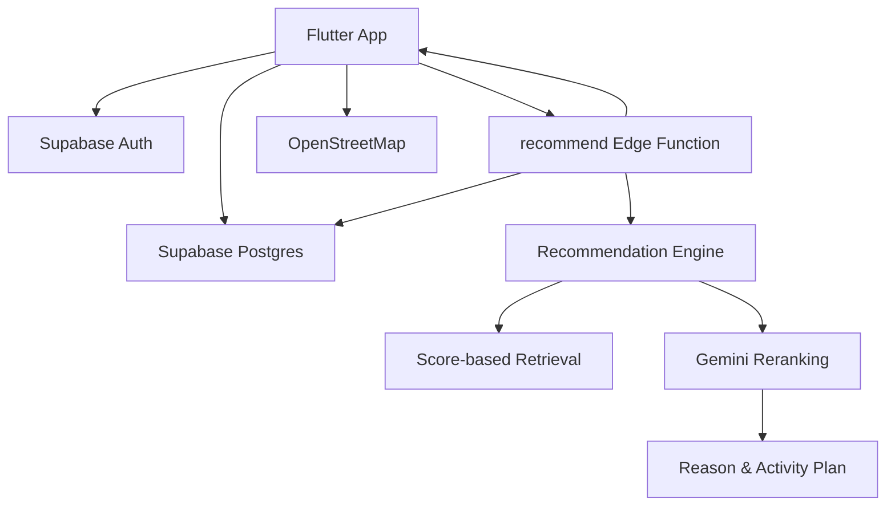

# HP+ (Healing Place)

> 사용자의 남은 시간, 목적, 현재 컨디션을 바탕으로 유성구의 휴식/공부 공간을 추천하는 Flutter 기반 장소 추천 앱입니다.

HP+는 "지금 나에게 맞는 공간"을 빠르게 찾는 경험에 초점을 둔 모바일/웹 애플리케이션입니다. 사용자는 간단한 설문으로 상황을 입력하고, 앱은 위치와 장소 특성, 이동 시간, AI 재랭킹을 조합해 도서관, 스터디카페, 카페, 룸카페 등을 추천합니다.

## 프로젝트 목표

일반적인 장소 검색은 사용자가 직접 키워드, 거리, 리뷰를 비교해야 합니다. HP+는 사용자의 현재 맥락을 먼저 묻고, 그 맥락에 맞는 장소와 활동 계획을 제안하는 방향으로 설계했습니다.

- 사용자의 목적이 과제인지 휴식인지에 따라 다른 질문 흐름 제공
- 현재 위치 또는 기본 유성구 좌표를 기준으로 이동 시간 반영
- Supabase Edge Function에서 점수 기반 후보 추출 후 Gemini로 추천 이유 생성
- 추천 장소를 지도 위에 순위 마커로 표시
- 방문 기록, 즐겨찾기, 프로필, 소셜 피드 등 서비스 확장에 필요한 기반 구현

## 주요 기능

### 1. 상황 기반 장소 추천

Explore 탭에서 다음 조건을 입력해 추천을 받을 수 있습니다.

- 사용 가능 시간: 1시간 반, 3시간, 수업 전후, 하루 종일, 직접 입력
- 목적: 과제/공부 또는 휴식
- 동행/활동 방식: 혼자, 모임, 조용한 휴식, 가벼운 이동 등
- 현재 상태: 집중 부족, 피로, 충전 필요, 스트레스 과다 등

추천 결과는 장소명, 순위, 예상 이동 시간, 태그, AI 추천 이유, 추천 활동 계획으로 구성됩니다.

### 2. 지도 중심 탐색 경험

- `flutter_map`과 OpenStreetMap 타일을 사용한 지도 UI
- 현재 위치 권한 요청 및 좌표 반영
- 추천 결과가 도착하면 장소별 순위 마커 표시
- Home 탭의 지도 프리뷰를 누르면 Explore 탭으로 이동

### 3. Supabase 기반 인증과 데이터 관리

- Supabase Auth 이메일/비밀번호 로그인 및 회원가입
- 회원가입 시 `profiles` 레코드 자동 생성 트리거
- `places`, `profiles`, `shared_posts`, `favorites`, `visits`, `llm_usage` 테이블 구성
- Row Level Security 정책 적용
- 방문 기록과 즐겨찾기는 로그인 사용자 기준으로 관리

### 4. AI 추천 Edge Function

추천 로직은 클라이언트가 아니라 Supabase Edge Function에서 실행됩니다.

1. Flutter 앱이 설문 응답과 위치 정보를 `recommend` 함수로 전송
2. Edge Function이 Supabase `places` 데이터를 조회
3. 설문 응답을 5축 사용자 상태 벡터로 변환
4. 장소 특성, 거리, 이동 시간, 시간 여유를 기준으로 후보 점수 계산
5. Gemini가 후보를 재정렬하고 추천 이유/활동 계획 생성
6. LLM 사용 제한 초과 또는 오류 시 점수 기반 fallback 반환

이 구조를 통해 API 키를 클라이언트에 노출하지 않고, 추천 정책과 비용 제어를 서버에서 관리합니다.

### 5. 활동 기록과 개인화 기반

- Place Detail 화면에서 장소 사용 기록 저장
- Home 탭에서 최근 방문 장소와 방문/저장 통계 표시
- Favorite Places 화면에서 즐겨찾기 목록 조회
- Activity History 화면에서 방문 내역 조회
- My Profile 화면에서 이름, 학교, 전공 등 프로필 수정

### 6. 소셜 피드 기반

- `shared_posts` 테이블과 `SocialRepository` 구현
- 작성자, 장소, 좋아요 수, 작성 시간을 포함한 피드 모델 구성
- 현재는 등록된 공유 글 목록과 빈 상태를 표시하는 MVP 단계
- 향후 장소 공유, 경로 공유, 댓글/좋아요 기능으로 확장 가능

### 7. 다국어 지원

- Flutter 공식 `gen-l10n` 기반
- 한국어/영어 ARB 리소스 구성
- `LocaleController`와 `shared_preferences`로 선택 언어 저장
- Profile 탭에서 언어 토글 제공

## 기술 스택

| 영역 | 기술 |
| --- | --- |
| App | Flutter, Dart, Material 3 |
| State | StatefulWidget, ChangeNotifier |
| Backend | Supabase Auth, Postgres, RLS, Edge Functions |
| AI | Gemini REST API |
| Map | flutter_map, OpenStreetMap, latlong2, geolocator |
| i18n | flutter_localizations, intl, gen-l10n |
| Deploy | Netlify Web Build, Supabase Functions |
| Test | Flutter test, Deno test |

## 아키텍처



클라이언트는 UI 상태와 사용자 입력을 담당하고, 장소 데이터 조회/추천/LLM 호출은 Supabase 계층에서 처리합니다. 네트워크 실패 시에는 앱에 번들된 `assets/data/yuseong_places.json`을 fallback 데이터로 사용합니다.

## 추천 엔진 설계

추천 엔진은 `retrieve -> rerank` 흐름입니다.

- `survey.ts`: 설문 응답을 사용자 상태 벡터로 변환
- `score.ts`: 장소 후보 필터링, 적합도 점수, 접근성 점수 계산
- `geo.ts`: 거리와 도보 이동 시간 계산
- `llm.ts`: Gemini 프롬프트 구성, JSON 응답 파싱, fallback 처리
- `engine.ts`: 전체 추천 파이프라인 조합
- `index.ts`: HTTP 요청 처리, Supabase 조회, 일일 LLM 사용량 제어

LLM 응답이 실패해도 서비스가 멈추지 않도록, 점수 기반 후보를 그대로 추천하는 fallback 경로를 구현했습니다.

## 데이터베이스 구조

| 테이블 | 역할 |
| --- | --- |
| `places` | 추천 대상 장소 데이터 |
| `profiles` | Supabase Auth 사용자와 1:1로 연결되는 프로필 |
| `shared_posts` | 소셜 피드 게시글 |
| `favorites` | 사용자별 즐겨찾기 |
| `visits` | 사용자별 방문 기록 |
| `llm_usage` | Gemini 일일 호출량 제한 관리 |

초기 장소 데이터는 유성구 기준 21개 장소로 구성되어 있으며, Supabase 마이그레이션과 로컬 JSON asset 양쪽에 반영되어 있습니다.

## 화면 구성

| 화면 | 설명 |
| --- | --- |
| Login / Signup | Supabase Auth 기반 로그인/회원가입 |
| Home | 지도 프리뷰, 추천 진입 카드, 방문/저장 통계, 최근 방문 |
| Explore | 지도, 위치 버튼, 설문 시트, 추천 결과 시트 |
| Place Detail | 장소 상세, 태그, 추천 활동, 즐겨찾기, 방문 기록 |
| Social | 공유 게시글 목록 |
| Profile | 프로필, 활동 기록, 알림, 즐겨찾기, 언어 설정, 로그아웃 |
| My Profile | 사용자 프로필 조회/수정 |
| Activity History | 방문 기록 목록 |
| Favorite Places | 즐겨찾기 장소 목록 |

## 폴더 구조

```text
lib/
  main.dart                         # Supabase 초기화, Locale 로드, AuthGate
  config/
    supabase_config.dart            # Supabase URL/Anon Key 설정
  data/
    services/                       # Supabase, 위치, 추천, 프로필, 활동 repository
    place_ui_mapper.dart
  domain/                           # 추천 usecase/entity 실험 구조
  l10n/                             # ARB 원본과 gen-l10n 결과
  models/                           # Place, Recommendation, Profile, Survey 모델
  screens/                          # 탭/상세/인증 화면
  theme/                            # 색상, spacing, radius, Material theme
  widgets/                          # 지도, 카드, chip 공통 위젯

supabase/
  migrations/                       # DB schema, seed, 좌표, LLM usage
  functions/recommend/              # 추천 Edge Function

assets/
  data/yuseong_places.json          # 장소 fallback 데이터

docs/
  spec.md                           # 구현 명세
```

## 실행 방법

### 1. 의존성 설치

```bash
flutter pub get
```

### 2. 앱 실행

```bash
flutter run -d chrome
```

Supabase 프로젝트를 바꿔 실행하려면 `--dart-define`을 사용합니다.

```bash
flutter run -d chrome \
  --dart-define=SUPABASE_URL=YOUR_SUPABASE_URL \
  --dart-define=SUPABASE_ANON_KEY=YOUR_SUPABASE_ANON_KEY
```

### 3. 정적 분석 및 테스트

```bash
flutter analyze
flutter test
```

### 4. Edge Function 테스트

```bash
cd supabase/functions/recommend
deno test --allow-env
```

## 배포

### Flutter Web

```bash
flutter build web --release
```

이 저장소에는 Netlify 배포 설정이 포함되어 있습니다.

```toml
# netlify.toml
[build]
  command = "flutter build web --release"
  publish = "build/web"
```

### Supabase Edge Function

```bash
supabase functions deploy recommend
```

필요한 환경 변수:

- `SUPABASE_URL`
- `SUPABASE_SERVICE_ROLE_KEY`
- `GEMINI_API_KEY`
- `GEMINI_MODEL`
- `GEMINI_DAILY_LIMIT`

## 구현하면서 신경 쓴 부분

- API 키 보호를 위해 Gemini 호출을 Edge Function으로 분리
- 추천 실패 시에도 빈 화면 대신 점수 기반 fallback 제공
- Supabase RLS로 사용자별 방문/즐겨찾기 데이터 접근 제한
- 서버 데이터 조회 실패 시 로컬 JSON asset으로 장소 목록 fallback
- 지도와 설문 시트를 한 화면에 배치해 탐색 흐름 단축
- 한국어/영어 리소스를 분리해 다국어 확장 가능하게 구성

## 현재 상태와 개선 예정

현재 구현은 추천, 지도, 인증, 프로필, 방문 기록, 즐겨찾기, 소셜 피드 기반을 포함한 MVP입니다.

앞으로 개선할 수 있는 부분:

- 소셜 게시글 작성/수정/삭제 UI
- 실제 도보 경로 polyline 데이터 연동
- 검색바와 카테고리 필터의 실제 필터링 연결
- 장소 이미지 업로드 및 관리
- 추천 결과 클릭 시 장소 상세 화면 연결
- 더 정교한 장소 벡터, 운영 시간, 콘센트/좌석 정보 반영

## 프로젝트 한 줄 요약

HP+는 장소 검색을 "어디 갈까?"에서 "지금 내 상태에 맞는 공간은 어디일까?"로 바꾸는 것을 목표로 만든 Flutter + Supabase + AI 기반 장소 추천 서비스입니다.
